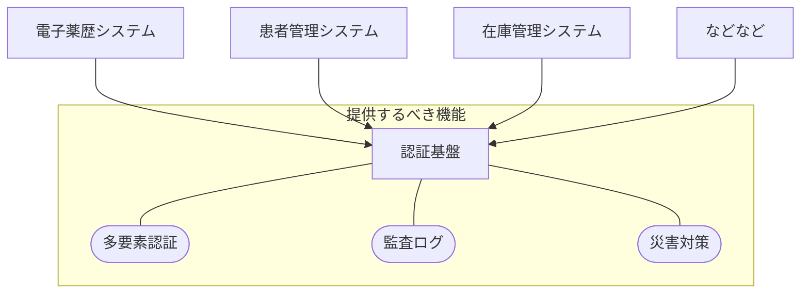
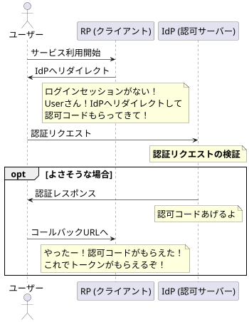
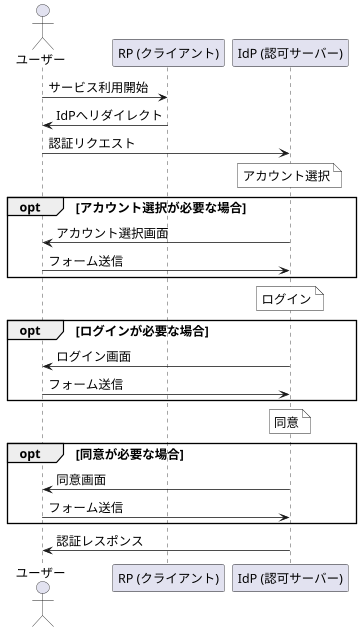
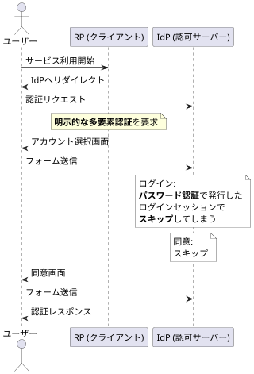

---
# try also 'default' to start simple
theme: ./theme
# random image from a curated Unsplash collection by Anthony
# like them? see https://unsplash.com/collections/94734566/slidev
# background: /bg.png
# some information about your slides, markdown enabled
title: 堅牢な認証基盤の実現:TypeScriptで代数的データ型を活用する
info: |
    ## Slidev Starter Template
    Presentation slides for developers.

    Learn more at [Sli.dev](https://sli.dev)
# apply any unocss classes to the current slide
class: text-center
# https://sli.dev/custom/highlighters.html
highlighter: shiki
# https://sli.dev/guide/drawing
drawings:
    persist: true
# slide transition: https://sli.dev/guide/animations#slide-transitions
transition: immediate-fade
# enable MDC Syntax: https://sli.dev/guide/syntax#mdc-syntax
mdc: true
---

# 堅牢な認証基盤の実現:<br/>TypeScriptで<br/>代数的データ型を活用する

### 株式会社カケハシ <br/> 岩佐 幸翠 (@kosui_me)

---
layout: two-cols-header
layoutClass: grid-cols-[128px_1fr]!
---

# 自己紹介

## kosui (岩佐 幸翠)

::left::

</img>

::right::

- 2019-2022  
  ソーシャルゲームを提供する会社で認証基盤の開発に従事
- 2022-現在  
  株式会社カケハシへ入社  
  - 日本の医療を変革させるという気持ちが発生  
    バリバリに新規事業へコミットするつもりだった  
  - しかしプロダクトを開発していく中で  
    プロダクトを支える基盤システムの品質に危機感を抱く  
  - 「俺が本当の基盤システムを作るんだ」  
    気がついたらまた認証基盤などの開発に従事していた

<!--
-00:40
-->

---

# この発表の目的 
## 感動を伝えたい

### 課題

医療システムという _命に関わるシステム_ の認証基盤を担うことになってしまった  

認証基盤は _複雑な状態管理_ が必要なシステム

### 解決策

_代数的データ型_ によって認証フローの取りうる状態と遷移が明確になり

- 人間: 開発者が認証フローを構造的に捉えることに成功した
- システム: 不正な状態や遷移を型検査で防止できた

_代数的データ型が命を救う_ と言っても過言ではない!?  

この発表が実務でFPを実践し価値を生み出す一助になれば嬉しい

<!--
-1:30
-->

---

# 目次

1. **課題**  
  認証基盤の複雑な状態管理
1. **提案**  
  代数的データ型と状態と振る舞いの分離
1. **事例**  
  認証基盤における活用例
    - 認証フローの状態遷移の明確化
    - 検証漏れの予防
    - 認証リクエストと取りうる認証フローの明確化

<!--
-2:00
-->

---

# 背景

## 医療システムの認証基盤

カケハシは医療システムを複数提供している  
医療を支えるシステムは患者の要配慮個人情報を扱う  

命に関わるシステムの品質要件は高い  

→ OpenID Connectを用いた認証基盤が  
認証に関する機能要件・品質要件を一手に引き受ける

<Transform scale="0.7">



</Transform>

<!--
-2:30
-->

---
layout: two-cols-header
layoutClass: grid-cols-[400px_1fr]!
---

# 課題

## OpenID Connect 認可コードフロー

::left::

### 登場人物

- **ユーザー**  
  RPのサービスを利用する
- **RP (Relying Party; クライアント)**  
  ユーザーの認証をIdPに委任するために  
  IdPへ認証リクエストを送信する
- **IdP (Identity Provider; 認可サーバー)**  
  認証リクエストを受け付けて  
  ユーザーを認証する

「認証リクエストの検証」が今日のテーマ

::right::



<!--
-3:10
-->

---

# 課題

## 認可コードフロー: 認証リクエストの検証

認証リクエストを受け付けたIdP (認可サーバー) は  
3つのステップを踏んで認証リクエストを検証する  

<div class='flex gap-8'>

<div class='flex flex-col gap-2'>
<h3>1. アカウント選択</h3>
<div class='mini-form'>
<label for='name'>ログインID</label>
<input type=text id='name' name='name' value='foo@example.com'>
<button class='self-end'>次へ</button>
</div>
</div>

<div class='flex flex-col gap-2'>
<h3>2. ログイン</h3>
<div class='mini-form'>
<label for='name'>ログインID</label>
<select id='name' name='name'>
<option value='foo@example.com'>foo@example.com</option>
</select>
<label for='password'>パスワード</label>
<input type=password id='password' name='password' value='xxxxxxxxxxxxxxxx'>
<div class='self-end flex gap-1'>
</div>
<div class='self-end flex gap-1'>
<button>次へ</button>
</div>
</div>
</div>

<div class='flex flex-col gap-2'>
<h3>3. 同意</h3>
<div class='mini-form'>
<p>foo@example.com さん</p>

このアプリへの情報提供に同意しますか？

- メールアドレス

<div class='self-end flex gap-1'>
<button>同意する</button>
<button class='abort'>同意しない</button>
</div>
</div>
</div>

</div>

一見、シンプルに見える！


<!--
-3:30
-->

---

# 課題

## 認可コードフロー: 認証リクエストの検証の難しさ 😈

OIDCでは認証リクエストのパラメータによって各ステップの検証条件が変化する😱

<div class='flex gap-8 f-16'>

<div class='flex flex-col gap-2'>
<h3>1. アカウント選択</h3>

<div class='mini-form'>
<label for='name'>ログインID</label>
<input type=text id='name' name='name' value='foo@example.com'>
<button class='self-end'>次へ</button>
</div>

- `prompt=none`  
  アカウント選択画面の表示は **禁止**
- `prompt=select_account`  
  アカウント選択画面の表示が **必要**
- `subject`  
  事前に指定されたアカウントを選択

</div>

<div class='flex flex-col gap-2'>
<h3>2. ログイン</h3>

<div class='mini-form'>
<label for='name'>ログインID</label>
<select id='name' name='name'>
<option value='foo@example.com'>foo@example.com</option>
</select>
<label for='password'>パスワード</label>
<input type=password id='password' name='password' value='xxxxxxxxxxxxxxxx'>
<div class='self-end flex gap-1'>
</div>
<div class='self-end flex gap-1'>
<button>次へ</button>
</div>
</div>

- `prompt=none`   
  ログイン画面の表示は **禁止**
- `prompt=login`   
  明示的な再認証  
  ログイン画面の表示が **必要**
- `acr_values=mfa`  
  多要素認証を要求する  

</div>

<div class='flex flex-col gap-2'>
<h3>3. 同意</h3>
<div class='mini-form'>
<p>foo@example.com さん</p>

このアプリへの情報提供に同意しますか？

- メールアドレス

<div class='self-end flex gap-1'>
<button>同意する</button>
<button class='abort'>同意しない</button>
</div>
</div>

- `prompt=none`   
  同意画面の表示は **禁止**
- `prompt=consent`   
  同意画面の表示が **必要**
- `scope`  
  事前に指定されたスコープに応じて  
  必要な同意を要求する
</div>

</div>


<style>
.slidev-layout {
  .mini-form {
    font-size: 10px;
    line-height: 1.2;
    max-width: 80%;
    margin: 0 auto;
  }
  .f-16 {
    font-size: 14px;
  }
}
</style>

<!--
-4:00
-->

---
layout: two-cols-header
layoutClass: grid-cols-[360px_1fr]!
---

# 課題 / 認証基盤の複雑な状態管理

## 提供が必要な機能たち

::left::



::right::

- **画面表示のスキップ**  
  ログインセッションや認証リクエスト次第で    
  各画面を表示せず次のステップへ (左図)
- **認証リクエストの多様なパラメータ** (前述)
  - `prompt=login` 明示的な再認証を要求
  - `acr_values=mfa` 多要素認証を要求
  - `subject=foo@example.com` 特定のアカウントを指定

<!--
-4:30
-->

---
layout: two-cols-header
layoutClass: grid-cols-[320px_1fr]!
---

# 課題 / 認証基盤の複雑な状態管理
## 不具合により起こりうる障害

::left::



::right::

状態遷移を適切に処理しなければ...

### 意図しない状態遷移

- 二要素認証を要求し忘れた場合  
  パスワードだけで患者情報が閲覧できてしまう  
  → 患者情報の漏洩  
  → 病歴が漏洩  
  → 犯罪・差別の助長  
  → 患者の命に関わる

状態遷移を適切に処理しなければ  
人間の生命すら脅かす可能性がある

<!--
-5:00
-->

---
layout: two-cols-header
---

# 課題 / 認証基盤の複雑な状態管理

## 認証フローの状態を表現する: 素朴な実装

::left::

<Transform scale="0.95">

```ts
// 認証フローの状態
type AuthFlow = {
  accountSelect?: AccountSelected;
  login?: LoggedIn;
  consent?: Consented;
};
```

```ts
// アカウント選択
type AccountSelected = {
  userId: string;
  accountSelectedAt: Date;
};
// ログイン
type LoggedIn = {
  method: "Password" | "Passkey" | "EmailPin";
  loggedInAt: Date;
};
// 同意
type Consented = { consentedAt: Date; };
```
</Transform>

::right::

### 認証フローの状態を `AuthFlow` として表現

#### 認証フローのステップ

1. アカウント選択 `AccountSelected`
2. ログイン `LoggedIn`
3. 同意 `Consented`

未完了のステップは `undefined` で表現

<!--
-5:30
-->

---
layout: two-cols-header
---

# 課題 / 認証基盤の複雑な状態管理

## 素朴な実装の課題

::left::

<Transform scale="0.95">

```ts
// 認証フローの状態
type AuthFlow = {
  accountSelect?: AccountSelected;
  login?: LoggedIn;
  consent?: Consented;
};
```

```ts
// アカウント選択
type AccountSelected = {
  userId: string;
  accountSelectedAt: Date;
};
// ログイン
type LoggedIn = {
  method: "Password" | "Passkey" | "EmailPin";
  loggedInAt: Date;
};
// 同意
type Consented = { consentedAt: Date; };
```
</Transform>

::right::

### 認証フローの状態 `AuthFlow` の問題点

**不正な状態も表現できてしまう**  

<Transform scale="1">

```ts
// 例) アカウント未選択なのにログイン済み
// 型検査を通過してしまう
const badFlow: AuthFlow = {
  accountSelect: undefined,
  login: {
    method: "Password",
    loggedInAt: new Date()
  },
  consent: undefined,
};
```
</Transform>

開発者は正しい状態を型ではなく  
手続きやテストから推測する必要がある  


<!--
-5:50
-->

---
layout: fact
---

## 提案

<br/>

# 状態を代数的データ型で表現し<br/>状態と振る舞いを分離する

---

## 提案

### 状態を代数的データ型で表現する

状態を _代数的データ型_ で表現することで  
認証フローが取りうる状態を明瞭に表現できる

```ts
type OnStarted = { accountSelect?: undefined; login?: undefined; consent?: undefined; };
type OnAccountSelected = { accountSelect: AccountSelected; login: undefined; consent: undefined };

type AuthFlow = OnStarted | OnAccountSelected | OnLoggedIn | OnConsented;
```

<br/>

### 状態と振る舞いの分離

状態と振る舞いを一体化させたクラスではなく  
_状態を表すデータ型_ と _振る舞いを表す関数_ に分離することで  
振る舞いの事前条件と事後条件を明確にできる

```ts
function selectAccount(flow: OnStarted, email: Verified<Email>): OnAccountSelected;
```

<!--
-6:30
-->

---
layout: two-cols-header
---

# 提案 / 代数的データ型で状態を明確に

## 代数的データ型とは

::left::

### 直積型

複数の型を組み合わせて一つの型を表す型  
例) レコードやタプル

```ts
type Profile = { id: string; email: string; };
```

::right::

### 直和型

いずれか一つを表す型  
例) 判別可能なユニオン型

```ts
type UserKind =
  | { kind: "Customer"; customerId: string; }
  | { kind: "Seller"; storeId: string; };
```

::bottom::

### 代数的データ型

直積型と直和型の組み合わせ
```ts
type User  = {
  profile: Profile;
  kind: UserKind;
};
```

<!--
-7:00
-->

---

# 提案 / 代数的データ型で状態を明確に

## 認証フローの状態を代数的データ型で表現する

まずは認証フローの取りうる状態をおさらい

| 状態 | アカウント選択 | ログイン | 同意 |
|------|----------------|----------|------|
| 開始後 | 未完了         | 未完了   | 未完了 | 
| アカウント選択後 | **完了**           | 未完了   | 未完了 |
| ログイン後 | **完了**            | **完了**      | 未完了 |
| 同意後 | **完了**            | **完了**      | **完了**    |


これを代数的データ型で表現すると...

<!--
-7:30
-->

---
layout: two-cols-header
---

# 提案 / 代数的データ型で状態を明確に

## 認証フローの状態を代数的データ型で表現する

<div class="grid grid-cols-[repeat(2,_1fr)] gap-4">
<div>

```ts {all|4-6}
/** 開始後 */
type OnStarted = Readonly<{
  type: "OnStarted";
  accountSelect: undefined;
  login: undefined;
  consent: undefined;
}>;
```

</div>
<div>

**開始後** の認証フロー

アカウント選択、ログイン、同意  
いずれも未完了

全てのフィールドは `undefined` で表現する

</div>
</div>


<div class="grid grid-cols-[repeat(2,_1fr)] gap-4">
<div>

```ts {all|4}
/** アカウント選択後 */
type OnAccountSelected = Readonly<{
  type: "OnAccountSelected";
  accountSelect: AccountSelected;
  login: undefined;
  consent: undefined;
}>;
```

</div>
<div>

**アカウント選択後** の認証フロー

アカウント選択のみ完了

</div>
</div>

<!--
-7:50
-->

---
layout: two-cols-header
---

# 提案 / 代数的データ型で状態を明確に

## 認証フローの状態を代数的データ型で表現する

取りうる状態をさらに定義していく

<div class="grid grid-cols-[repeat(4,_1fr)] gap-1 flows">

```ts
/** 開始後 */
type OnStarted = Readonly<{
  type: "OnStarted";
  accountSelect: undefined;
  login: undefined;
  consent: undefined;
}>;
```

```ts
/** アカウント選択後 */
type OnAccountSelected = Readonly<{
  type: "OnAccountSelected";
  accountSelect: AccountSelected;
  login: undefined;
  consent: undefined;
}>;
```

```ts
/** ログイン後 */
type OnLoggedIn = Readonly<{
  type: "OnLoggedIn";
  accountSelect: AccountSelected;
  login: LoggedIn;
  consent: undefined;
}>;
```

```ts
/** 同意後 */
type OnConsented = Readonly<{
  type: "OnConsented";
  accountSelect: AccountSelected;
  login: LoggedIn;
  consent: Consented;
}>;
```
</div>

「認証フローは上記のいずれかを取る」と表現できる


```ts
/** 認証フロー */
type AuthFlow = OnStarted | OnAccountSelected | OnLoggedIn | OnConsented;
```

<style>
.slidev-layout {
    .flows code {
        font-size: 10.5px;
        line-height: 1;
    }
}
</style>

<!--
-8:00
-->

---
layout: two-cols-header
---

# 提案 / 代数的データ型で状態を明確に

## 代数的データ型による表現の効果

認証フローが取りうる状態を明瞭に表現できる  
型を見ればどんな状態が許容されるか一目瞭然！

不正な状態を型検査で防止できる

<Transform scale="0.9">

```ts twoslash
type AccountSelected = { userId: string; accountSelectedAt: Date; };
type LoggedIn = { method: "Password" | "Passkey" | "EmailPin"; loggedInAt: Date; };
type Consented = { consentedAt: Date; };
/** 開始後 */
type OnStarted = Readonly<{
  type: "OnStarted";
  accountSelect: undefined;
  login: undefined;
  consent: undefined;
}>;
/** アカウント選択後 */
type OnAccountSelected = Readonly<{
  type: "OnAccountSelected";
  accountSelect: AccountSelected;
  login: undefined;
  consent: undefined;
}>;
/** ログイン後 */
type OnLoggedIn = Readonly<{
  type: "OnLoggedIn";
  accountSelect: AccountSelected;
  login: LoggedIn;
  consent: undefined;
}>;
/** 同意後 */
type OnConsented = Readonly<{
  type: "OnConsented";
  accountSelect: AccountSelected;
  login: LoggedIn;
  consent: Consented;
}>;
// ---cut---
/** 認証フロー */
type AuthFlow = OnStarted | OnAccountSelected | OnLoggedIn | OnConsented;

// アカウントを選択していないのにログインしている状態は不正
const badFlow = {
  type: "OnLoggedIn",
  accountSelect: undefined,
  login: { method: "Password", loggedInAt: new Date() },
  consent: undefined,
} as const satisfies AuthFlow;
```

</Transform>

<!--
-8:30
-->

---

# 提案 / 状態と振る舞いを分離する
## 振る舞いの表現

`selectAccount` : `OnStarted` のみを引数に取り、`OnAccountSelected` を返す  
関数のシグニチャを見れば遷移元の状態と遷移先の状態が明確に分かる🎉

```ts
const selectAccount = (userId: UserId, now: Date) =>
  (flow: OnStarted): OnAccountSelected => ({
    ...flow,
    accountSelect: { userId, accountSelectedAt: now },
  });
```

異常な状態遷移を型検査で防止できる🎉

<Transform scale="0.9">

```ts twoslash
type AccountSelected = { userId: string; accountSelectedAt: Date; };
type LoggedIn = { method: "Password" | "Passkey" | "EmailPin"; loggedInAt: Date; };
type Consented = { consentedAt: Date; };
type OnStarted = {
  accountSelect?: undefined;
  login?: undefined;
  consent?: undefined;
};
type OnAccountSelected = {
  accountSelect: AccountSelected;
  login?: undefined;
  consent?: undefined;
};
type OnLoggedIn = {
  accountSelect: AccountSelected;
  login: LoggedIn;
  consent?: undefined;
};
type OnConsented = {
  accountSelect: AccountSelected;
  login: LoggedIn;
  consent: Consented;
};
type UserId = string;

const selectAccount = (userId: UserId, now: Date) =>
  (flow: OnStarted): OnAccountSelected => ({
    ...flow,
    accountSelect: { userId, accountSelectedAt: now },
  });
// ---cut---
declare const userId: UserId;
declare const now: Date;
declare const flow: OnLoggedIn;
selectAccount(userId, now)(flow);
```

</Transform>

<!--
-9:00
-->

---
layout: fact
---

## 結果

<br/>

# 認証基盤における活用法

---

# 結果 / 認証基盤における活用法

## 検証漏れの予防

検証漏れを防ぐために検証の状態を明示的に管理する

ログインセッションを「検証済」と「未検証」に分ける  
検証済のログインセッションが必要な処理は「検証済のログインセッション」のみを引数に取る

```ts
type LoginSession = { kind: 'LoginSession'; user: User; expiresAt: Date; };
type Verified<T, K> = T & { kind: `Verified${K}`; verifiedAt: Date; };
type VerifiedLoginSession = Verified<LoginSession, 'LoginSession'>;

declare const skipAccountSelect:
  (session: LoginSession) => (flow: OnStarted) => OnAccountSelected;
  //        ^^^^^^^^^^^^ アカウントは未検証のログインセッションからも選択できてよい

declare const skipLogin:
  (session: VerifiedLoginSession) => (flow: OnAccountSelected) => OnLoggedIn;
  //        ^^^^^^^^^^^^^^^^^^^^^^ ログインは検証済のログインセッションからのみ可能
```

<!--
-9:30
-->

---
layout: two-cols-header
layoutClass: grid-cols-[320px_1fr]!
---

# 結果 / 認証基盤における活用法

## `prompt` パラメータ

::left::

OIDCの認証リクエストの難解な仕様も  
自然言語ではなく型で明確に表現する  

- `prompt=none` の場合  
  画面を表示してはいけない
- `prompt=login` の場合  
  明示的な再認証を要求する
- `prompt` が未指定の場合  
  画面を表示してもよい


::right::

<Transform scale="0.8">
```ts
type LoginSkipped = { type: 'LoginSkipped'; };
type LoginWithPassword = { type: 'LoginWithPassword'; };
type NoInteractionPrompt = { type: 'NoInteractionPrompt'; none: true; };
type InteractionPrompt = {
    type: 'InteractionPrompt';
    selectAccount: boolean;
    login: boolean;
    consent: boolean;
};
type Prompt = 
  | NoInteractionPrompt
  | InteractionPrompt;
type AuthFlow = {
    prompt: NoInteractionPrompt;
    login: LoginSkipped;
} |  {
    prompt: InteractionPrompt & { login: true };
    login: LoginWithPassword;
} | {
    prompt: InteractionPrompt & { login: false; };
    login: LoginSkipped | LoginWithPassword;
};
```
</Transform>

<!--
-10:00
-->

---
layout: two-cols-header
layoutClass: grid-cols-[560px_1fr]!
---

# 結果 / 認証基盤における活用法

## 認証フローのワークフロー化

::left::

<div class="minicode">

```ts
import { Result, ok } from "neverthrow";

/** ユーザーに操作を要求する (画面を表示する) */
type ReqInteract<T> = { type: "ReqInteract"; view: T; };
/** ログインされていないため認証フローを続行できない */
type LoginRequired = { type: "LoginRequired"; };

declare const selectAccount: (userId: Verified<UserId>) =>
  (flow: OnStarted) =>
    Result<OnAccountSelected, ReqInteract<'AccountSelect'>>;
declare const skipLogin: (loginSession?: Verified<LoginSession>) =>
  (flow: OnAccountSelected) =>
    Result<OnLoggedIn, ReqInteract<'Login'> | LoginRequired>;
declare const skipConsent: (flow: OnLoggedIn) => Result<OnConsented, void>;

const runSelectAccountUseCase =
  (flow: OnStarted, userId: Verified<UserId>, loginSession?: Verified<LoginSession>):
    Result<OnAccountSelected,              
      | ReqInteract<'AccountSelect'>
      | ReqInteract<'Login'>
      | LoginRequired> =>
      ok(flow)
        .andThen(selectAccount(userId))
        .andThen(skipLogin(loginSession))
        .andThen(skipConsent)
```

</div>

::right::

各画面のユースケースを  
ワークフローとして表現する

発生しうる画面遷移やエラーを  
シグニチャで表現できる

リダイレクトや画面遷移が  
非常に多い認証基盤では  
これは非常にありがたいこと


<style>
.slidev-layout {
  .minicode {
    code {
      @apply grid grid-cols-1fr gap-6px;
      font-size: 11px;
      line-height: 1;
    }
  }
}
</style>

---

# まとめ

## 代数的データ型の活用

- **状態を明確に表現**  
  認証フローの状態を代数的データ型で表現することで  
  不正な状態遷移を型検査で防止できる
- **状態と振る舞いを分離**  
  状態と振る舞いを分離することで  
  振る舞いの事前条件と事後条件を明確にし、異常な状態遷移を防止できる

## 認証基盤における活用例

- 認証フローの状態遷移の明確化  
- 検証漏れの予防  
- OIDCの認証リクエストの仕様の明確化
