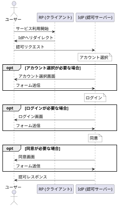
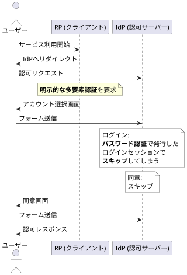

---
# try also 'default' to start simple
theme: ./theme
# random image from a curated Unsplash collection by Anthony
# like them? see https://unsplash.com/collections/94734566/slidev
background: /bg.png
# some information about your slides, markdown enabled
title: 堅牢な認証基盤の実現:TypeScriptで代数的データ型を活用する
info: |
    ## Slidev Starter Template
    Presentation slides for developers.

    Learn more at [Sli.dev](https://sli.dev)
# apply any unocss classes to the current slide
class: text-center
# https://sli.dev/custom/highlighters.html
highlighter: shiki
# https://sli.dev/guide/drawing
drawings:
    persist: false
# slide transition: https://sli.dev/guide/animations#slide-transitions
transition: immediate-fade
# enable MDC Syntax: https://sli.dev/guide/syntax#mdc-syntax
mdc: true
---

# 堅牢な認証基盤の実現:<br/>TypeScriptで<br/>代数的データ型を活用する

### 株式会社カケハシ <br/> 岩佐 幸翠 (@kosui_me)

---

# この発表の目的

## 対象

> 対象とする聴衆のレベル  
> Beginner: 分野の前提知識を必要としない

## よくある話

「関数型プログラミングには少し興味があるけれど  
どのように実務で活用できるか分からない」

## そこで...

関数型プログラミング (**_FP_**) に興味を持ち始めた方へ  
FPのパターンと実務における活用を橋渡ししたい

---

# この発表の目的

## FPのトレンド

- FPの思想やパターンが各言語へ  
  例) RustやJavaへのパターンマッチングの導入
- FPの思想を取り入れたライブラリへの注目  
  例) Effect(-TS)がThoughtworks Technology Radarで「Trial」へ

## FPと実務

「実務でFPをどう活かす？」「FPの事業価値は何か？」  
曖昧な問いには曖昧な返答しかできない

そこで **_代数的データ型_** と **_認証基盤_** を題材に  
FPのエッセンスを実際の業務に取り入れた事例から価値を理解する

---

# 目次

1. 堅牢な認証システムへの要求
1. 複雑な状態遷移
1. 代数的データ型
1. 検証漏れの防止  
   未検証のログインセッションと  
   検証済のログインセッションに分けて考える
1. 状態の永続化と監査ログの記録  
   状態の変化をイベントとして表現  
   イベントごとにリポジトリとロガーを実装する

---

# 背景

## 医療システムの認証基盤

医療を支えるシステムは患者の要配慮個人情報を扱う  
命に関わるシステムの品質要件は高い


---

# 課題

## 認証基盤の複雑な状態管理

認証のフローは3つのステップから構成される  
一見シンプルに見えるが...?

<div class='flex gap-8'>

<div class='flex flex-col gap-2'>
<h3>1. アカウント選択</h3>
<div class='mini-form'>
<label for='name'>ログインID</label>
<input type=text id='name' name='name' value='foo@example.com'>
<button class='self-end'>次へ</button>
</div>
</div>

<div class='flex flex-col gap-2'>
<h3>2. ログイン</h3>
<div class='mini-form'>
<label for='name'>ログインID</label>
<select id='name' name='name'>
<option value='foo@example.com'>foo@example.com</option>
</select>
<label for='password'>パスワード</label>
<input type=password id='password' name='password' value='xxxxxxxxxxxxxxxx'>
<div class='self-end flex gap-1'>
</div>
<div class='self-end flex gap-1'>
<button>次へ</button>
</div>
</div>
</div>

<div class='flex flex-col gap-2'>
<h3>3. 同意</h3>
<div class='mini-form'>
<p>foo@example.com さん</p>

このアプリへの情報提供に同意しますか？

- メールアドレス

<div class='self-end flex gap-1'>
<button>同意する</button>
<button class='abort'>同意しない</button>
</div>
</div>
</div>

</div>

---
layout: two-cols-header
layoutClass: grid-cols-[240px_1fr]!
---

# 課題 / 認証基盤の複雑な状態管理

## 提供が必要な機能たち

::left::



::right::

- **画面表示のスキップ**  
  ログインセッションや認証リクエスト次第で    
  各画面を表示せず次のステップへ (左図)
- **認可リクエストの豊富な機能**
  - `prompt=login` で明示的な再認証を要求
  - `acr_values=mfa` で多要素認証を要求
  - `subject` パラメータで特定のアカウントを指定
- **監査ログ**  
  認証の各ステップでログを記録する必要がある

---
layout: two-cols-header
layoutClass: grid-cols-[320px_1fr]!
---

# 課題 / 認証基盤の複雑な状態管理
## 不具合により起こりうる障害

::left::



::right::

状態遷移を適切に処理しなければ...

### 意図しない状態遷移

- 二要素認証を要求し忘れた場合  
  パスワードだけで患者情報が閲覧できてしまう  
  → 患者情報の漏洩

### 状態遷移後のハンドリング漏れ

- 多要素認証の場合のみ  
  監査ログを記録し忘れてしまう  
  → 不正な操作の調査が困難に


---

# 提案

## 状態と振る舞いを分離する

状態と振る舞いを一体化させたクラスではなく  
_状態を表すデータ型_ と _振る舞いを表す関数_ に分離する

→ 振る舞いごとに取りうる状態を明確に定義できる

## 振る舞いからドメインロジックとI/Oを分離する

状態を変化させる _ドメインロジック_ と  
新しい永続化を永続化する _I/O_ を分離する

→ 振る舞いのテストが容易になる


---
layout: two-cols-header
---

# 提案 / 状態と振る舞いを分離する

## 代数的データ型とは

::left::

### 直積型

複数の型を組み合わせて一つの型を表す型  
例) レコードやタプル

```ts
type User = { id: string; email: string; };
```

::right::

### 直和型

複数の型のいずれか一つを表す型  
例) 判別可能なユニオン型

```ts
type Login =
    | { type: "Password"; password: string; }
    | { type: "EmailPin"; email: string; };
```

::bottom::

### 代数的データ型

直積型と直和型の組み合わせ
```ts
type LoginSession = {
    user: User;
    login: Login;
};
```

---

# 提案 / 状態と振る舞いを分離する

## 認証フローの状態を代数的データ型で表現したい

|  | アカウント選択 | ログイン | 同意 |
|---|---|---|---|
| **開始後** | - | - | - |
| **アカウント選択後** | 選択済み | - | - |
| **ログイン後** | 選択済み | ログイン済み | - |
| **同意後** | 選択済み | ログイン済み | 同意済み |

これを代数的データ型で表現すると...

---

# 提案 / 状態と振る舞いを分離する

## 認証フローの状態を代数的データ型で表現

|  | アカウント選択 | ログイン | 同意 |
|---|---|---|---|
| **開始後**<br>`type OnStarted =` | -<br/>`& { accountSelect?: undefined }` | -<br/>`{ login?: undefined }` | -<br/>`{ consent?: undefined }` |
| **アカウント選択後**<br>`type OnAccountSelected =` | 選択済み<br/>`& { accountSelect: AccountSelect }` | -<br/>`& { login?: undefined }` | -<br/>`& { consent?: undefined }` |
| **ログイン後**<br>`type OnLoggedIn =` | 選択済み<br/>`& { accountSelect: AccountSelect }` | ログイン済み<br/>`& { login: Login }` | -<br/>`& { consent?: undefined }` |
| **同意後**<br>`type OnConsented =` | 選択済み<br/>`& { accountSelect: AccountSelect }` | ログイン済み<br/>`& { login: Login }` | 同意済み<br/>`& { consent: Consent }` |

<style>
.slidev-layout {
  table {
    td, th {
      padding-left: 0;
      padding-right: 0;
    }
     td {
      font-size: 14px;
      code {
        font-size: 12.5px;
      }
    }
  }
}
</style>
---
layout: two-cols-header
---

# 提案 / 状態と振る舞いを分離する

## 認証フローの状態を代数的データ型で表現

認証フローが取りうる状態を明瞭に表現できる

<Transform scale="0.9">

```ts twoslash
type AccountSelect = { userId: string; accountSelectedAt: Date; };
type Login = { method: "Password" | "Passkey" | "EmailPin"; loggedInAt: Date; };
type Consent = { consentedAt: Date; };
// ---cut---
type OnStarted =         { accountSelect?: undefined;     login?: undefined; consent?: undefined; };
type OnAccountSelected = { accountSelect:  AccountSelect; login?: undefined; consent?: undefined; };
type OnLoggedIn =        { accountSelect:  AccountSelect; login:  Login;     consent?: undefined; };
type OnConsented =       { accountSelect:  AccountSelect; login:  Login;     consent:  Consent;   };
/** 認証フロー */
type AuthFlow = OnStarted | OnAccountSelected | OnLoggedIn | OnConsented;

// アカウントを選択していないのにログインしている状態は不正
const badFlow = {
  accountSelect: undefined,
  login: { method: "Password", loggedInAt: new Date() },
  consent: undefined,
} as const satisfies AuthFlow;
```

</Transform>

---

# 提案 / 状態と振る舞いを分離する
## 振る舞いの表現

`login` : ログインを開始できる `OnAccountSelected` のみを引数に取る

```ts
type LoginMethod = "Password" | "Passkey" | "EmailPin";

const login = (flow: OnAccountSelected, loginMethod: LoginMethod): OnLoggedIn => ({
  ...flow,
  login: { method: loginMethod, loggedInAt: new Date() },
});
```

異常な状態遷移を型検査で防止できる

```ts twoslash
type OnStarted = {
  accountSelect?: never;
  login?: never;
  consent?: never;
};
type OnAccountSelected = {
  accountSelect: AccountSelect;
  login?: never;
  consent?: never;
};
type OnLoggedIn = {
  accountSelect: AccountSelect;
  login: Login;
  consent?: never;
};
type OnConsented = {
  accountSelect: AccountSelect;
  login: Login;
  consent: Consent;
};
type LoginMethod = "Password" | "Passkey" | "EmailPin";

const login = (flow: OnAccountSelected, loginMethod: LoginMethod): OnLoggedIn => {
  const loggedInAt = new Date();
  return {
    ...flow,
    login: { method: loginMethod, loggedInAt },
  };
};
// ---cut---
declare const flow: OnStarted;
login(flow, 'Password');
```

---

# 提案 / 状態と振る舞いを分離する

## 余談: 検証漏れの予防

検証漏れを防ぐために検証の状態を明示的に管理する

ログインセッションを「検証済」と「未検証」に分ける  
検証済のログインセッションが必要な処理は「検証済のログインセッション」のみを引数に取る

```ts
type LoginSession = { user: User; expiresAt: Date; };

type VerifiedLoginSession = LoginSession & { verified: true; verifiedAt: Date; };

declare const skipAccountSelect:
  (session: LoginSession) => (flow: OnStarted) => OnAccountSelected;
  //        ^^^^^^^^^^^^ アカウントは未検証のログインセッションからも選択できてよい

declare const skipLogin:
  (session: VerifiedLoginSession) => (flow: OnAccountSelected) => OnLoggedIn;
  //        ^^^^^^^^^^^^^^^^^^^^ ログインは検証済のログインセッションからのみ可能
```

---
layout: two-cols-header
---

# 提案

## 振る舞いからドメインロジックとI/Oを分離する

### ドメインロジックとI/O

- ドメインロジック: 状態を変化させる処理
- I/O: 外部システムとの接続  
  新しい状態を永続化する処理や監査ログの記録

### ドメインロジックとI/Oを分離する理由

- ドメインロジックのテストが容易になる
- I/Oの実装を変更してもドメインロジックのテストは影響を受けない
- I/Oの実装をモックしてドメインロジックのテストが可能になる

---
layout: two-cols-header
layoutClass: grid-cols-[400px_1fr]!
rightClass: w-full
---

# 提案 / 振る舞いからドメインロジックとI/Oを分離する

::left::

<Transform scale="0.8">

```ts
const onAccountSelected =
  async (flow: OnAccountSelected, session: LoginSession | undefined):
    Promise<Result<OnConsented, unknown>> => {
      if (session === undefined) {
        return { ok: false, err: "ログインセッションが未検証です" } as const;
      }
      const verifiedSessionRes = LoginSession.verify(session);
      if (verifiedSessionRes.ok
        && flow.accountSelect.userId === session.user.id) {
        const newFlow = {
          ...flow,
          login: {
            method: "LoginSession",
            loginSessionId: session.id,
            loggedInAt: new Date(),
          },
        } as const;
        await storeAuthFlow(newFlow);
        await storeAuditLog({
          type: "UserLoggedIn",
          eventAt: new Date(),
          flow: newFlow,
        });
        
        // TODO: 同意をスキップできるか検証
        // TODO: 同意もスキップできたら認証レスポンスの作成
        return ...;
      }
      


      return { ok: true, val: flow } as const;
    }
```
</Transform>

::right::

### ドメインロジックとI/Oが混じっている状態

- `storeAuthFlow`  
  認証フローを永続化する処理
- `storeAuditLog`  
  監査ログを記録する処理

認証フローの検証は長大な処理になりがち

どこで何を永続化したのか分からなくなる

<style>
.slidev-layout {
  pre code {
    font-size: 10px !important;
    line-height: 10px !important;
  }
}
</style>

---

### イベントを返す振る舞い

```ts
type UserLoggedInEvent = {
  type: "UserLoggedIn";
  eventAt: Date;
  flow: OnLoggedIn;
};

declare const login:
  (
    flow: OnAccountSelected,
    loginMethod: LoginMethod,
  ) => UserLoggedInEvent;
```

```ts
type UserLoggedInStore = {
  store: (event: UserLoggedInEvent) => Promise<void>;
};
```