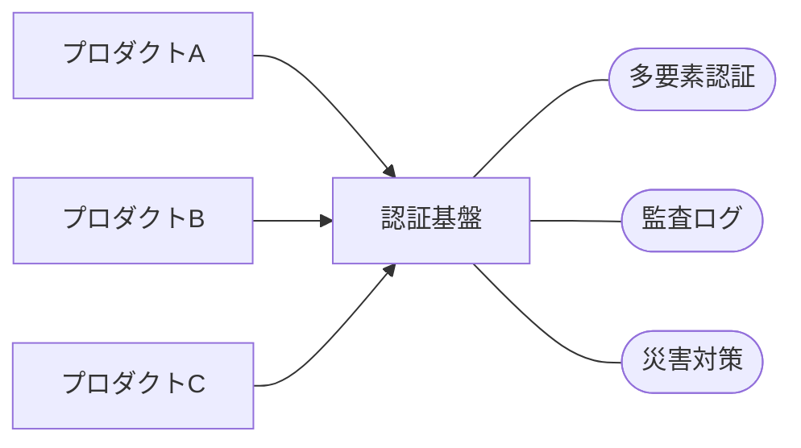

---
# try also 'default' to start simple
theme: ./theme
# random image from a curated Unsplash collection by Anthony
# like them? see https://unsplash.com/collections/94734566/slidev
background: /bg.png
# some information about your slides, markdown enabled
title: 堅牢な認証基盤の実現:TypeScriptで代数的データ型を活用する
info: |
    ## Slidev Starter Template
    Presentation slides for developers.

    Learn more at [Sli.dev](https://sli.dev)
# apply any unocss classes to the current slide
class: text-center
# https://sli.dev/custom/highlighters.html
highlighter: shiki
# https://sli.dev/guide/drawing
drawings:
    persist: false
# slide transition: https://sli.dev/guide/animations#slide-transitions
transition: immediate-fade
# enable MDC Syntax: https://sli.dev/guide/syntax#mdc-syntax
mdc: true
---

# 堅牢な認証基盤の実現:<br/>TypeScriptで<br/>代数的データ型を活用する

### 株式会社カケハシ <br/> 岩佐 幸翠 (@kosui_me)

---

# この発表の目的

## 対象

> 対象とする聴衆のレベル  
> Beginner: 分野の前提知識を必要としない

## よくある話

「関数型プログラミングには少し興味があるけれど  
どのように実務で活用できるか分からない」

## そこで...

関数型プログラミング (**_FP_**) に興味を持ち始めた方へ  
FPのパターンと実務における活用を橋渡ししたい

---

# この発表の目的

## FPのトレンド

- FPの思想やパターンが各言語へ  
  例) RustやJavaへのパターンマッチングの導入
- FPの思想を取り入れたライブラリへの注目  
  例) Effect(-TS)がThoughtworks Technology Radarで「Trial」へ

## FPと実務

「実務でFPをどう活かす？」「FPの事業価値は何か？」  
曖昧な問いには曖昧な返答しかできない

そこで **_代数的データ型_** と **_認証基盤_** を題材に  
FPのエッセンスを実際の業務に取り入れた事例から価値を理解する

---

# 目次

1. 堅牢な認証システムへの要求
1. 複雑な状態遷移
1. 代数的データ型
1. 検証漏れの防止  
   未検証のログインセッションと  
   検証済のログインセッションに分けて考える
1. 状態の永続化と監査ログの記録  
   状態の変化をイベントとして表現  
   イベントごとにリポジトリとロガーを実装する

---

# 背景

## 医療システムの認証基盤

医療を支えるシステムは患者の要配慮個人情報を扱う  
命に関わるシステムの品質要件は高い



---

# 課題

## 認証基盤の複雑さ: 状態の管理と遷移

認証のフローは3つのステップから構成される

<div class='flex gap-8'>

<div class='flex flex-col gap-2'>
<h3>1. アカウント選択</h3>
<div class='mini-form'>
<label for='name'>ログインID</label>
<input type=text id='name' name='name' value='foo@example.com'>
<button class='self-end'>次へ</button>
</div>
</div>

<div class='flex flex-col gap-2'>
<h3>2. ログイン</h3>
<div class='mini-form'>
<label for='name'>ログインID</label>
<select id='name' name='name'>
<option value='foo@example.com'>foo@example.com</option>
</select>
<label for='password'>パスワード</label>
<input type=password id='password' name='password' value='xxxxxxxxxxxxxxxx'>
<div class='self-end flex gap-1'>
</div>
<div class='self-end flex gap-1'>
<button>次へ</button>
</div>
</div>
</div>

<div class='flex flex-col gap-2'>
<h3>3. 同意</h3>
<div class='mini-form'>
<p>foo@example.com さん</p>

このアプリへの情報提供に同意しますか？

- メールアドレス

<div class='self-end flex gap-1'>
<button>同意する</button>
<button class='abort'>同意しない</button>
</div>
</div>
</div>

</div>

それぞれのステップへの遷移を誤ると **_セキュリティインシデント_** になる

とはいえ、一見シンプルに見えるが...?

---

# 課題

## 認証基盤の複雑さ: 状態の管理と遷移

クライアントからのリクエストに応じてステップごとに必要な処理が異なる

<div class='flex gap-8'>

<div class='flex flex-col gap-2'>
<h3>1. アカウント選択</h3>
<div class='mini-form'>
<label for='name'>ログインID</label>
<input type=text id='name' name='name' value='foo@example.com'>
<button class='self-end'>次へ</button>
</div>
<div class='mini-form'>
<button><mdi-devices />パスキーを使用する</button>
</div>
<div class='mini-form'>

画面をスキップ  
(認証リクエストのパラメータから)

</div>
<div class='mini-form'>

画面をスキップ  
(ログインセッションから)

</div>
</div>

<div class='flex flex-col gap-2'>
<h3>2. ログイン</h3>
<div class='mini-form'>
<label for='name'>ログインID</label>
<select id='name' name='name'>
<option value='foo@example.com'>foo@example.com</option>
</select>
<label for='password'>パスワード</label>
<input type=password id='password' name='password' value='xxxxxxxxxxxxxxxx'>
<div class='self-end flex gap-1'>
</div>
<div class='self-end flex gap-1'>
<button>次へ</button>
</div>
</div>
<div class='mini-form'>

<label for='password'>送信したメールのPINコード</label>
<input type=password id='password' name='password' value='xxxxxxxxxxxxxxxx'>

</div>
<div class='mini-form'>

画面をスキップ  
(有効なログインセッションから)

</div>
</div>

<div class='flex flex-col gap-2'>
<h3>3. 同意</h3>
<div class='mini-form'>
<p>foo@example.com さん</p>

このアプリへの情報提供に同意しますか？

- メールアドレス

<div class='self-end flex gap-1'>
<button>同意する</button>
<button class='abort'>同意しない</button>
</div>
</div>
<div class='mini-form'>

画面をスキップ  
(既に同意済み)

</div>
</div>

</div>

---

# 課題

## 認証基盤の複雑さ: 状態の管理と遷移

例) `prompt=none` の場合は _画面を表示してはいけない_

<div class='flex gap-8'>

<div class='flex flex-col gap-2'>
<h3>1. アカウント選択</h3>
<div class='mini-form'>
<label for='name'>ログインID</label>
<input type=text id='name' name='name' value='foo@example.com'>
<button class='self-end'>次へ</button>
</div>
<div class='mini-form'>
<button><mdi-devices />パスキーを使用する</button>
</div>
<div class='mini-form'>

画面をスキップ  
(認証リクエストのパラメータから)

</div>
<div class='mini-form'>

画面をスキップ  
(ログインセッションから)

</div>
</div>

<div class='flex flex-col gap-2'>
<h3>2. ログイン</h3>
<div class='mini-form'>
<label for='name'>ログインID</label>
<select id='name' name='name'>
<option value='foo@example.com'>foo@example.com</option>
</select>
<label for='password'>パスワード</label>
<input type=password id='password' name='password' value='xxxxxxxxxxxxxxxx'>
<div class='self-end flex gap-1'>
</div>
<div class='self-end flex gap-1'>
<button>次へ</button>
</div>
</div>
<div class='mini-form'>

<label for='password'>送信したメールのPINコード</label>
<input type=password id='password' name='password' value='xxxxxxxxxxxxxxxx'>

</div>
<div class='mini-form'>

画面をスキップ  
(有効なログインセッションから)

</div>
</div>

<div class='flex flex-col gap-2'>
<h3>3. 同意</h3>
<div class='mini-form'>
<p>foo@example.com さん</p>

このアプリへの情報提供に同意しますか？

- メールアドレス

<div class='self-end flex gap-1'>
<button>同意する</button>
<button class='abort'>同意しない</button>
</div>
</div>
<div class='mini-form'>

画面をスキップ  
(既に同意済み)

</div>
</div>

</div>

---

# 課題

## 認証基盤の複雑さ: 状態の管理と遷移

例) `prompt=login&subject=bar@example.com` の場合  
_bar\@example.com_ として _明示的な再認証_ が必要

<div class='flex gap-8'>

<div class='flex flex-col gap-2'>
<h3>1. アカウント選択</h3>
<div class='mini-form'>
<label for='name'>ログインID</label>
<input type=text id='name' name='name' value='foo@example.com'>
<button class='self-end'>次へ</button>
</div>
<div class='mini-form'>
<button><mdi-devices />パスキーを使用する</button>
</div>
<div class='mini-form'>

画面をスキップ  
(認証リクエストのパラメータから)

</div>
<div class='mini-form'>

画面をスキップ  
(ログインセッションから)

</div>
</div>

<div class='flex flex-col gap-2'>
<h3>2. ログイン</h3>
<div class='mini-form'>
<label for='name'>ログインID</label>
bar@example.com (変更不可)
<label for='password'>パスワード</label>
<input type=password id='password' name='password' value='xxxxxxxxxxxxxxxx'>
<div class='self-end flex gap-1'>
</div>
<div class='self-end flex gap-1'>
<button>次へ</button>
</div>
</div>
<div class='mini-form'>

<label for='password'>送信したメールのPINコード</label>
<input type=password id='password' name='password' value='xxxxxxxxxxxxxxxx'>

</div>
<div class='mini-form'>

画面をスキップ  
(有効なログインセッションから)

</div>
</div>

<div class='flex flex-col gap-2'>
<h3>3. 同意</h3>
<div class='mini-form'>
<p>bar@example.com さん</p>

このアプリへの情報提供に同意しますか？

- メールアドレス

<div class='self-end flex gap-1'>
<button>同意する</button>
<button class='abort'>同意しない</button>
</div>
</div>
<div class='mini-form'>

画面をスキップ  
(既に同意済み)

</div>
</div>

</div>

---

# 課題

## 状態遷移を適切に処理しなければ...

### 検証漏れ

- ログインセッションの検証漏れ

### 意図しない状態遷移

- 明示的な再認証のし忘れ
- 二要素認証を要求し忘れて、流出したパスワードだけで患者情報が閲覧できてしまう

### 状態遷移後のハンドリング漏れ

- パスキー認証の場合のみ  
  監査ログを記録し忘れてしまう

---

# 提案

## データと振る舞いを分離する

## 振る舞いを「イベントを発生させる純粋関数」とする

---
layout: two-cols-header
---

# 提案: データと振る舞いを分離する

::left::

### 直積型

複数の型を組み合わせて一つの型を表す型

```ts
type User = {
    id: string;
    name: string;
    email: string;
};
```

::right::

### 直和型

複数の型のいずれか一つを表す型

```ts
type LoginSession =
    | { type: "Password"; password: string }
    | { type: "Passkey"; passkeyId: string }
    | { type: "EmailPin"; email: string; };
```

::bottom::

### 代数的データ型

直積型と直和型の組み合わせ

---

# 提案: データと振る舞いを分離する

## 検証漏れの予防

ログインセッションを「検証済」と「未検証」に分ける  
検証済のログインセッションが必要な処理は「検証済のログインセッション」のみを引数に取る

```ts
type BaseLoginSession =
    | { type: "Password"; password: string }
    | { type: "Passkey"; passkeyId: string }
    | { type: "EmailPin"; email: string; };

type VerifiedLoginSession =
    & BaseLoginSession
    & { verified: true; verifiedAt: Date; expiresAt: Date };

type UnverifiedLoginSession =
    & BaseLoginSession
    & { verified: false; reason: string; };

type LoginSession = VerifiedLoginSession | UnverifiedLoginSession;
```

---

# 提案: データと振る舞いを分離する

## 状態の表現

```ts
type LoggedIn =
  & { kind: "LoggedIn"; loggedInAt: Date; }
  & (
    | { type: "ByPassword"; userId: string; }
    | { type: "ByPasskey"; passkeyId: string; }
    | { type: "ByEmailPin"; email: string; }
  )

type AccountSelected =
  & { kind: "AccountSelected"; selectedAt: Date; }
  & (
    | { type: "ByLoginSession"; loginSession: VerifiedLoginSession; }
    | { type: "BySubject"; subject: string; }
    | { type: "ByPasskey"; passkeyId: string; }
  );
```

---